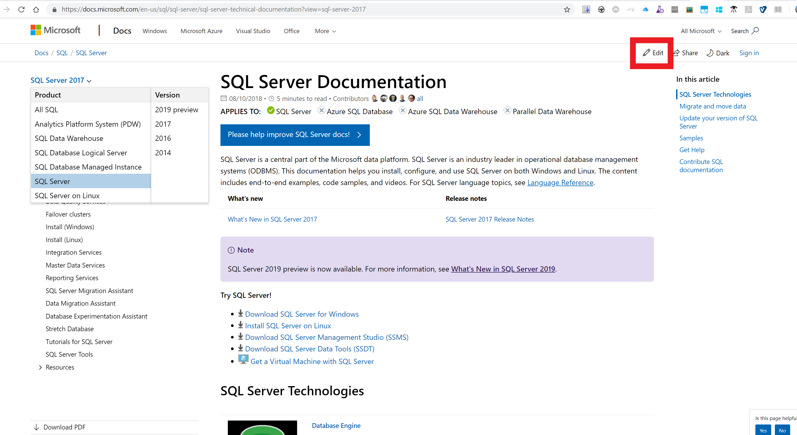

---
# Mandatory fields. See more on aka.ms/skyeye/meta.
title: implementing or changing Edit button on Docs topic / page
description: Getting started 
author: jmazzotta
ms.author: joemaz
ms.date: 08/11/2018
ms.topic: contributor-guide
ms.prod: docs
---
# Implementing Edit button

This article steps through implementing Edit button on a Docs topic page.

## Pre-reqs:
1. Your repo will need to be public. If the repo is private, the below implementation steps will NOT warn you that the Edit button will NOT be displayed on Docs. 
2. tbd

## Lets get started:
 -  There are 2 ways you can enable Edit button 
     - through the OPS Portal, which will require someone from the Docs team to enable on your behalf. Use https://aka.ms/publish-on-docs to request the Docs team to enable Edit button. 
     - through updating the openpublishing.publish.config.json file in your public repo

## Enable Edit button through configuration change in openpublishing.publish.config.json   
1. In your editor of choice or directly in github.com, the openpublishing.publish.config.json file should be at the root
2. Open the openpublishing.publish.config.json to edit 
3. Add the 2 following lines of code: 
    -   "git_repository_url_open_to_public_contributors": "https://github.com/...",
    -   "git_repository_branch_open_to_public_contributors": "branch"
- Important notes:
- if the following 2 lines are inserted anywhere except at the bottom of the json file, then you will need to add a comma after the last line (eg "branch",)
- for the first attribute git_repository_url_open_to_public_contributors, you will want to modify the repo URL to point to your public repo (eg https://github.com/jmazzotta/onboarding-demo)
- for the second attribute git_repository_branch_open_to_public_contributors, you will want to modify the branch name to point to the precise branch you would like users to edit the contents (eg "master", or "live",)
- Here is an example of the Edit button in action on Docs:
    - https://github.com/jmazzotta/onboarding-demo/blob/master/.openpublishing.publish.config.json
    - corresponding topic on Docs: https://review.docs.microsoft.com/en-us/onboarding-demo/setup?branch=master
