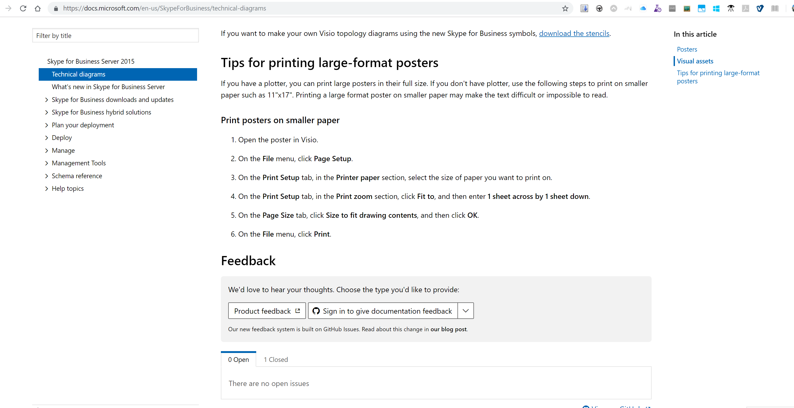

---
# Mandatory fields. See more on aka.ms/skyeye/meta.
title: implementing or changing documentation feedback
description: Getting started 
author: jmazzotta
ms.author: joemaz
ms.date: 08/11/2018
ms.topic: contributor-guide
ms.prod: docs
---
# Implementing Documentation feedback

This article steps through implementing documentation feedback button on at the bottom of Docs topic page.

## Pre-reqs:
1. Your repo will need to be public.  
2. You need to define workflow/process for addressing documentation feedback. You should not turn on feedback only to have customers log feedback in GitHub issues on your content then not address or follow up in a timely manner. 
3. If your repo is not in the https://github.com/MicrosoftDocs/ org within GitHub, then you will need to authorize OPS on your github org. See video here on how to do that: https://msit.microsoftstream.com/video/de8ad2eb-8dbf-4b66-8e6c-751cb586eeba
4. You need to enable Github issues within your repo. Here is Github help to ensure Issues are enabled on your repo: https://help.github.com/articles/creating-an-issue/ 

## Lets get started:
 -  To enable documentation feedback using GitHub Issues:
     - add the following 